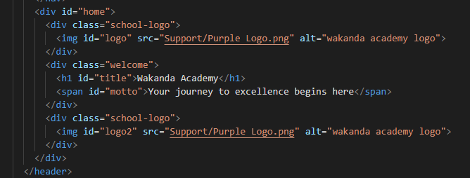
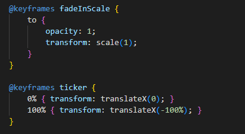
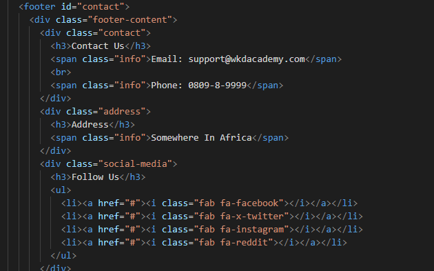

# About Wakanda Academy
 Wakanda Academy is a groundbreaking educational institution dedicated to empowering students with the knowledge, skills, and mindset to excel in a rapidly changing world. Our academy fosters an environment of innovation, creativity, and holistic development, ensuring that each student is prepared to become a leader and trailblazer in their chosen field.At Wakanda Academy, we utilize a holistic educational approach that combines traditional academics with experiential learning. Our students engage in project-based learning, interdisciplinary studies, and hands-on experiences that encourage them to connect knowledge across subjects and apply it practically.

## Visit
https://www.jcxmusic.site/

## Documentation
(This deployment is made with the assumption that the GitHub repository is updated.)

this porject using a lot of meta available to reach 100 point SEO in google lighthouse.

showing the sequence i use for navbar and hamburger button, there is a functional language selector and dark-mode button.

to make navbar is neat and burger button aplied at 768px screen width.

this is java script to let burger button animation and news animation works.

in header there is some text in the middle of 2 images.

this is only a trial.

now html for running news is complete.

this is for animation the main section to pop up when user arrive at the page.

it used at faculty.html to let user know who is the primcipal and teachers at wakanda academy.

to arrange card that will fit section.

to make sure card will responsive at tablet.

css to control grid for laptop/computer screen.

css to make grid responsive at tablet screen.

css to control grid for phone/mobile screen.

css to control grid for laptop/computer screen.

to make animation where navbar background color appeared when scrolled.

adding css to class or tag or id to be acknowledged by js.

to what tag or id or class that will change, and how it will work. Also will use localstorage like translate.

to what tag or id or class that will change, and how it will work. Also will use localstorage like translate.

part of js that shown english translation.

part of js that shown indonesian translation.

part of js that shown japanese translation.

part of js that shown how to make button works and to set id to switch.

part of js that shown what id to pick and switch.

shown footer html.

## Tools
The tools is all recommended for beginners, for example:

