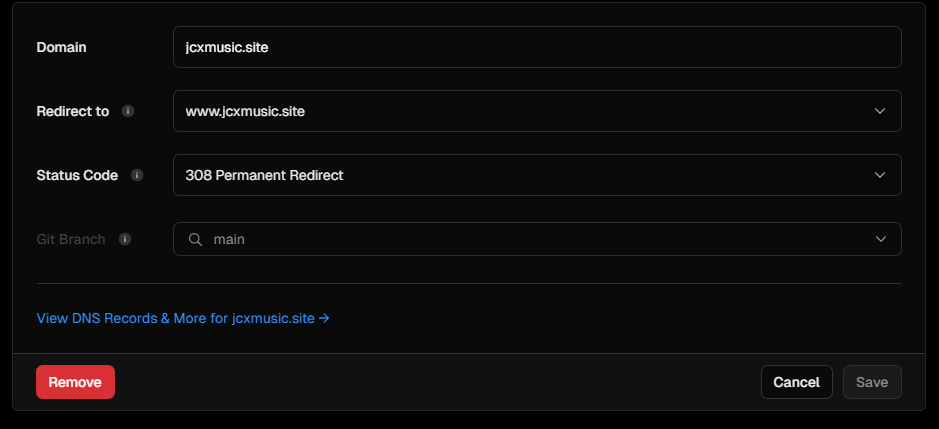

# About Wakanda Academy
 Wakanda Academy is a groundbreaking educational institution dedicated to empowering students with the knowledge, skills, and mindset to excel in a rapidly changing world. Our academy fosters an environment of innovation, creativity, and holistic development, ensuring that each student is prepared to become a leader and trailblazer in their chosen field.At Wakanda Academy, we utilize a holistic educational approach that combines traditional academics with experiential learning. Our students engage in project-based learning, interdisciplinary studies, and hands-on experiences that encourage them to connect knowledge across subjects and apply it practically.

## Visit
[Visit Here](https://www.jcxmusic.site/)

(author can't afford a new domain.)

## Disclaimer
To build this company profile web, author used internet such as [w3school](https://www.w3schools.com/), [codepen](https://codepen.io/), [youtube](https://www.youtube.com/), [chatGPT](https://chatgpt.com/) (for translation only) here is the [proof](https://chatgpt.com/c/78e83db4-8068-4ba6-b27a-fa20738ec74f) and his ******* friend that works as a senior front end developer that tricked author to make a few page and use javascript more than enough.

In this readme.md author will only including index.html styles.css and script.js and there is a few memes in documentation.

## Documentation

#### Html

this is author when building html:

Here we go.

Meta author used is to make web look good on all devices, set keywords for search engine, description of this website, author name, etc. Author also embed Rubik font, Wittgenstein font, and font awesome for clipart.

The html author used for navbar and hamburger button, there is a functional language switcher and dark-mode button.

Header content used logo author create that will change in dark mode.

Html author used for running news with text.

Html content with about, missions, visions, and programs.

Html content with facilities showing assymetrical grid.

Html footer with information contact, address, and link to social media.

#### CSS

This is authors problem in css

Now, back to it.

Css body, set background, margin, padding, font, and fontcolor.

This css shown author used pseudo element to put effect on every first letter in p tag and styling header to put different font.

This css is used to set navbar stay at the top of the page, and styling navbar.

This css is used for styling the button.

This css is used for styling and setting running news.

This is the most annoying one, author frustated just to make this little **** works just fine. (Part One). 

Used for styling hamburger button and hiding it, for now.

Used for setting animation in the page and the running news.

Used for making the page responsive at 768px or tablet device, in this image is navbar, and hamburger button also put menu button inside burger button.

Used for animating burger button, when it opened it will transform to close button.

This is annoying, author frustated just to make this little **** works just fine. (Part Two).

Used to make web page responsive at 425px or mobile/phone and logo at the header smaller so it doesn't overflow.

This is annoying, author frustated just to make this little **** works just fine. (Part Three).

Used for js to recognize what to change when dark mode enabled.

#### Javascript

One of the most tiring one. Author used AI to check grammars.

One of the most tiring one. Author used AI for translate. (even though it's authors mother tounge)

Author definitely used AI to translate this one.

Author adopted his frontend friend idea to make this. And author quoted his friend say "translation is a must in company profile and it works just like dark mode".
And this is author reaction while author almost have typhus (tifus a.k.a tipes) to make it work:

"TrAnSLatioN iS a MuSt In CoMpAnY pRoFiLe AnD iT WOrkS JuSt LiKe DaRk MoDe"

Used to set running news works.

Used to make hamburger button can be opened and showing menu

Used to set current mode as light mode by tracking id on elements.

Used to set which item will be shown (tracked by id or class) if dark mode enabled.

Used to set what action to make dark mode toggled.

Used to set what action to make the navbar have background color. In this case is scrolled more than 30px.

#### Deployment

Opening vercel clicked the former project.

Go to domain.

Go to edit.

Choose remove.

Remove.

Click add new.

Add new project (Compro).

Name the project and deploy.

Continue to dashboard.

Go to domain.

Add custom domain.

Custom domain will insantly works because DNS isn't change from the former project in hosting provider.

## Tools
The tools is all recommended for beginners, for example:

